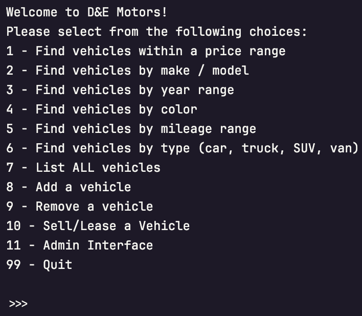
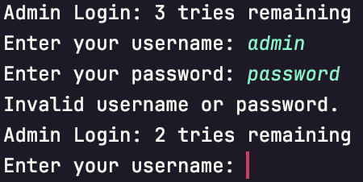
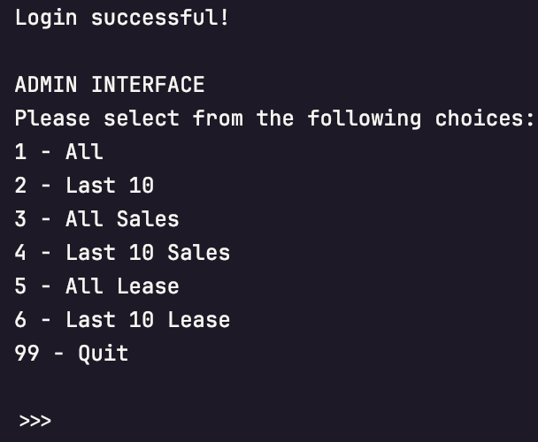

  

<h1 align="center">Advanced Dealership</h1>

---

### Project Overview

This is a dealership management application with the following features:

1. **Vehicle Inventory Management**:
   - Search for vehicles with multiple filters (e.g., make, model, year, price, mileage).
   - Add, remove, sell, or lease vehicles from the inventory
2. **Admin Interface**:
   - Secure, password-protected admin interface accessible only by authorized administrators.
   - Support for multiple admin accounts, each with individual login credentials.
3. **Security Features**:
   - Passwords are stored as SHA-256 hashes for security; plaintext passwords are never stored.
   - Password hashing is applied at account creation and every time a login attempt is made.
   - To prevent unauthorized access, only 3 login attempts are allowed before further attempts are locked.

---

### Dealership CSV

Explanation of the file and its format:

1. **General Structure**:
   - The file contains a header row with dealership information, followed by rows representing individual vehicle entries.
   - All data is contained within a single column, with values separated by the pipe symbol (|).
   
2. **Header**:
    - The header row contains basic dealership information in the format: `Dealership Name | Address | Contact Number`
    - Example: `D&E Motors|123 Awesome Lane|555-867-5309`
   
3. **Vehicle Data Rows**:
   - Each row after the header represents one vehicle, with fields separated by the | symbol. The fields appear to follow this structure: `VIN | Year | Make | Model | Type | Color | Mileage | Price`
   - `VIN` -  A unique identifier for the vehicle.
   - `Year` -  Model year of the vehicle.
   - `Make` -  Manufacturer of the vehicle (e.g., Toyota, Honda).
   - `Model` -  Specific model of the vehicle (e.g., Corolla, Civic).
   - `Type` -  Classification of the vehicle (e.g., car, truck).
   - `Color` -  Exterior color of the vehicle.
   - `Mileage` -  Odometer reading in miles.
   - `Price` -  Sale or lease price of the vehicle in dollars.

4. **Sample Data**:
   - Here’s a sample entry based on the format observed: `837492|2022|Toyota|Corolla|car|White|1500|25999.99`
   - This entry represents a `2022 Toyota Corolla`, classified as a `white` `car` with `1,500` miles on it, priced at `$25,999.99`.

5. **Assumptions the program makes**:
   - **All** values are assumed to be `strings`, except for `Mileage` and `Price`, which are **numeric**.

---

### Contracts CSV

Each contract in the CSV is either a sale or lease record with customer and vehicle information, formatted as follows:

1. **Common Fields**:
    - Each contract includes the following fields:
    - `Contract Type | Date | Customer Name | Customer Email | VIN | Year | Make | Model | Type | Color | Odometer | Price`
    - These fields are consistent across both SALE and LEASE contracts.
      - `Contract Type` - Indicates `SALE` or `LEASE`.
      - `Date` - Date of the contract in `YYYYMMDD` format.
      - `Customer Name` - Full name of the customer.
      - `Customer Email` - Email address of the customer.
      - `VIN` - Unique identifier for the vehicle.
      - `Year, Make, Model, Type, Color` - Vehicle details.
      - `Odometer` - Vehicle mileage.
      - `Price` - Sale price or base price for leasing.

2. **Sale-Specific Fields**:
   - `Sales Tax` - Calculated at `5%` of the vehicle price.
   - `Recording Fee` - Fixed at `$100.00`.
   - `Processing Fee` - A standard fee added to the sale.
   - `Total Price` - Final price including fees and taxes.
   - `Financed` - Indicates if the vehicle is financed (`YES` or `NO`).
   - `Monthly Payment` - Applicable if financed; otherwise set to `0`.
3. **Lease-Specific Fields**:
   - `Expected Ending Value` - Estimated vehicle value at lease end (50% of price).
   - `Lease Fee` - Calculated at 7% of the vehicle price.
   - `Total Price` - Total cost over the lease term.
   - `Monthly Payment` - Payment amount for the lease term.

4. **Add-Ons**:
   - Each contract may include additional add-ons, appended at the end of each row as:
   - `Add-On Name | Add-On Price`
   - The program includes some default `Add-Ons`:
     - `Nitrogen Tires` - Premium nitrogen tire fill for better pressure stability.
     - `Window Tinting` - Professional window tinting for UV protection.
     - `Floor Mats` - All-season rubber floor mats.
     - `Splash Guards` - Custom-fit splash guards.
     - `Cargo Tray` - Heavy-duty cargo area protector.
     - `Wheel Locks` - Security wheel locks with unique key.

---

### Lease and Finance Rates

These constants are used to calculate specific costs for lease and financing options within contracts:

- `Lease Fee Rate` - Set at `7% of the vehicle price` for lease contracts.
- `Expected End Value Rate` - Calculated as `50% of the vehicle price` to determine the expected vehicle value at the end of the lease term.
- `Finance Rate` - Annual interest rate of `4%` for financed sales contracts.
- `Lease Term` - Standard `3-year (36 months)` lease period.

These constants help standardize financial terms, ensuring consistent calculation of fees, residual values, and monthly payments across all contracts.

---

### Screenshots

*Screenshot of the Home Screen.*

*Screenshot of Login Screen*

*Screenshot of the Admin Interface*

